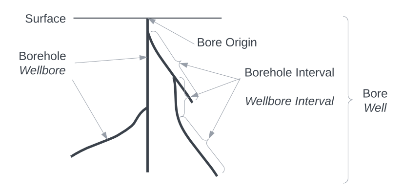

# Bore Model

## Definition

A model that describes physical, functional and operational aspects of Bores, sometimes known as Wells.

## Location

This model is online at:

* **<https://linked.data.gov.au/def/bore>**

## Place in Supermodel

Bores are a special kind of _Site_ within the [Sites & Admin Features](sites-admin.md) model. 

## Concepts

The main concepts of this model are shown on the following figure of a bore:

<a href="../../assets/bore/Concepts.svg">
<figure id="figure-bc" markdown>
  
  <figcaption>Figure Bore 1: Bores Model intro figure</figcaption>
</figure>
</a>

## Elements 

An overview of the elements of this model is:

<a href="../../assets/bore/Overview.svg">
<figure id="figure-bo" markdown>
    
  <figcaption>Figure Bore 2: Overview of the model of this Bores Model. The Bore class must be related to one or more Boreholes which, in turn, may have zero or more Borehole Intervals. Bores, Boreholes & Borehole Intervals are geospatial Features and may have Geometries recorded and Samples may be taken from them. Bores may be attributed to Agents (people and organisations) with the attribution qualified with Roles. A number of vocabulary-based classifiers are available for the Bore, such as Borehole Purpose, whose values are selected from controlled vocabularies listed within this Model. Some and datatype predicates are also available, such as depth.</figcaption>
</figure>
</a>

> The Key for the elements in this Figure is the [figure key for this Supermodel](../supermodel.md#modelling-conventions).
