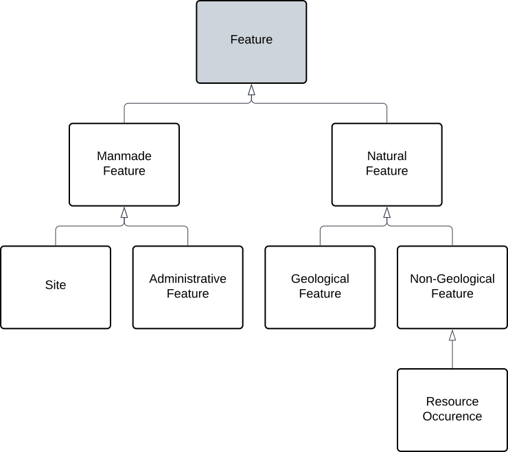
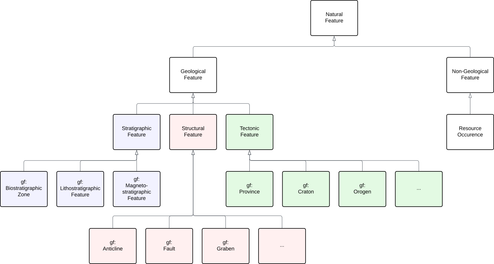

# Geo Features Hierarchy

RDF: [geofh.ttl](https://github.com/Geological-Survey-of-Western-Australia/GSWA-Supermodel/blob/main/rdf/components/geofh.ttl)

<a href="../../assets/geofh/hierarchy.svg">
<figure id="figure-gfh" markdown style="width:70%">
  
  <figcaption>Figure GFH: The top 3 levels of this model's class hierarchy</figcaption>
</figure>
</a>

## Purpose 

This component model describes the overarching hierarchy of geological and geospatial features classes used by GSWA to describe Mines, Sites, Cratons, Basins etc. and also Tenement Areas, Administrative Areas etc.

The purpose of making a single hierarchy it to allow for the orderly integration of data about all types of feature. 

For example, the hierarchy groups the _Tenement Area_ & _Permit Area_ classes under the parent class _Administrative Feature_. This grouping allows querying of these two specialised classes on any properties of the parent as this hierarchy ensures they both have them.

## Model logic

The logic of this component model is shown in the class hierarchy diagram above:

* all features known to GSWA are either 'Man-made', 'Natural' or some specialised form of either 
* visible man-made features are Sites or a specialised form of Site, such as Bore
* Administrative Features are man-mad features that may not be visible on the ground, e.g. a Tenement Area which may exist only in a GIS system
* Resource Occurrences - where economically viable resources are - are natural but not geological features since they have non purely geological logic used to define them

## Hierarchy

The hierarchy of feature types - classes of feature - is:

* Feature
  * Man-made Feature
    * Site
      * Mine
      * Bore
      * ...
    * Administrative Feature
      * Administrative Boundary
        * Tenement Area
        * Permit Area
      * ...
  * Natural Feature
    * Geological Feature
      * Stratigraphic Feature
        * Biostratigraphic Feature
        * Lithostratigraphic Feature
        * Magnetostratigraphic Feature
      * Structural Feature
        * Anticline
        * Fault
        * Graben
        * ...
      * Tectonic Feature
        * Province
        * Craton
        * Orogen
        * ...
    * Non-Geological Feature
      * Resource Occurrence

<a href="../../assets/geofh/mm-hierarchy.svg">
<figure id="figure-gfh" markdown style="width:80%">
  
  <figcaption>Figure MMGFH: Man-made Feature types</figcaption>
</figure>
</a>

<a href="../../assets/geofh/n-hierarchy.svg">
<figure id="figure-gfh" markdown style="width:100%">
  
  <figcaption>Figure NGFH: Natural Feature types</figcaption>
</figure>
</a>