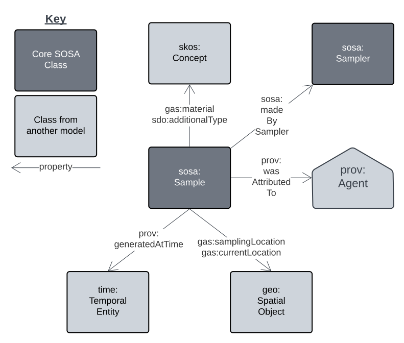

# Geosample Model

<a href="../../assets/geosamples-overview.svg">
<figure id="figure-bh" markdown style="width:70%">
  
  <figcaption>Geosamples Model overview</figcaption>
</figure>
</a>

The model used for samples within this Supermodel is the [Geosamples Model](https://kurrawong.github.io/geosamples-model/model.html) which "...describes physical attributes and important relationships of geological samples". This model is limited to just describing samples themselves and their direct relationships to other object but not those other objects.

## Geosamples Model extensions

Within this Supermodel, the Geosamples Model is extended to allow for:

* [Feature of Interest details](#feature-of-interest-details) - the thing sampled
* [Observations on a Sample](#observations-on-a-sample)

### Feature of Interest details

Samples can be made from other Samples and any other kind of thing, such as a Bore, Site, Rock Unit etc. This is always indicated using the predicate `sosa:isSampleOf`.

From the Sample's point-of-view, the thing it is a sample of is the _Feature Of Interest_, regardless of what kind of thing it is.

Furthermore, a Sample may be of another Sample and sampling chains may be of any length:

_Part Sample_ `isSampleOf` _Whole Sample_ `isSampleOf` _Rock Unit_.

Some models consider Bores and even Mines as _sampling features_, i.e. things that sample other things to produce samples, such as the Rock Unit the Bore is drilled in to. So we can have:

_Part Sample_ `isSampleOf` _Whole Sample_ `isSampleOf` _Bore_ `isSampleOf` _Rock Unit_.

The things that samples are aiming to characterise are the _Ultimate Feature of Interest_ so, as per the example immediately above, that would be the _Rock Unit_.

### Observations on a Sample

Observations of the properties of samples are often made and the [SOSA](../background.md#sosa) model represents this by having instances of `sosa:Observation` that target instances of `sosa:Sample` with the `sosa:hasFeatureOfInterest` predicate, just as Samples target other things.

Observations are very similar to Samples, but they produce _Results_ which are normally categorisations or numerical measures of the properties of something, such as the gold content of a Sample's material.

The very detailed [Geochemistry Model](https://linked.data.gov.au/def/geochem) should be used for geochemistry observations of Samples.

An example:

```turtle
ex:sample-x
    a sosa:Sample ;
    sosa:isSampleOf ex:sample-n ;
    schema:material ex:Rock ;
    schema:usedProcedure ex:CoreDrill ;
    sdo:additionalType ex:CoreSectionHalf ;
.

ex:observation-y
    a sosa:Observation ;
    sosa:hasFeatureOfInterest ex:sample-x ;
    sosa:userProcedure ex:procedure-z ;
    sosa:observedProperty ex:occurence-of-gold-in-a-matrix ;
    sosa:hasResult [
        a sosa:Result ;
        qudt:unit unit:PPM ;
        rdf:value "124.0"^^xsd:float ;
    ] ;
.
```

## Vocabularies

Vocabularies supporting this model and the positions within the model they occupy are listed and described below.

| **Vocabulary**                                                                                                                                                                                  | **Description**                                | **Model Position**                                                                       |
|-------------------------------------------------------------------------------------------------------------------------------------------------------------------------------------------------|------------------------------------------------|------------------------------------------------------------------------------------------|
| [GSWA Sample Materials](https://linked.data.gov.au/def/gswa-sample-materials)<br /><br />Derived from [GA's Material Type](http://pid.geoscience.gov.au/def/voc/ga/materialtype) vocabulary     | Types of material which samples may consist of | Range value for `schema:material` predicate used on a `Sample` instance                  |
| [GSWA Specimen Types](https://linked.data.gov.au/def/gswa-specimen-types)<br /><br />Derived from [ODM's Specimen Type](http://vocabulary.odm2.org/specimentype) vocabulary                     | Types of physical Specimen                     | Range value for `sdo:additionalType` predicate used on a `Sample` instance               |
| [GSWA Sampling Methods](https://linked.data.gov.au/def/gswa-sampling-methods)<br /><br />Derived from [GA's Sampling Method](http://pid.geoscience.gov.au/def/voc/ga/samplingmethod) vocabulary | Methods used to collect geological samples     | Range value for `sosa:usedProcedure` predicate used on `Sample` and `Sampling` instances |

## Mappings

Mappings from this model to other initiatives are described below. 

### IGSN Description Model

<http://schema.igsn.org/description/>

_Coming_

### GeoSciML - GeologicSpecimenView

<https://docs.ogc.org/is/16-008/16-008r1.html#443>

_Coming_
