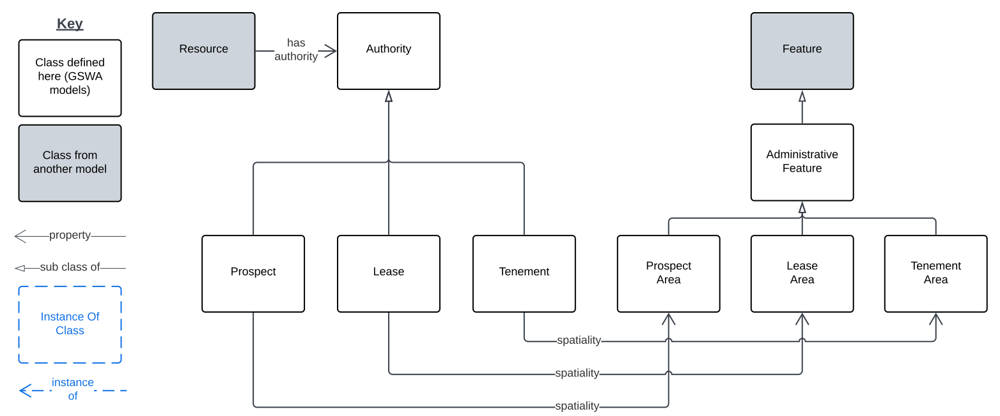

# Mining Authorisation Model

RDF: [mining-authorisation.ttl](https://github.com/Geological-Survey-of-Western-Australia/GSWA-Supermodel/blob/main/rdf/components/mining-authorisation.ttl)

## Overview

<a href="../../assets/authorities-Overview.svg">
<figure id="figure-bh" markdown>
  
  <figcaption>Figure AO: Mining Authorisation Model overview</figcaption>
</figure>
</a>

This Mining Authorisation Model caters for legal and policy instruments that give permission or exclusivity to own/operate mining-related operations, usually in designated areas. 

_This model has only just been started._

